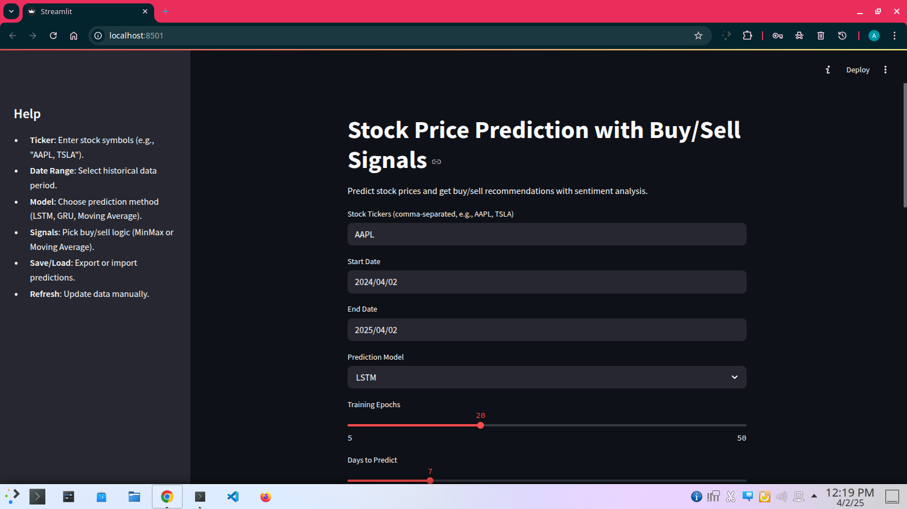
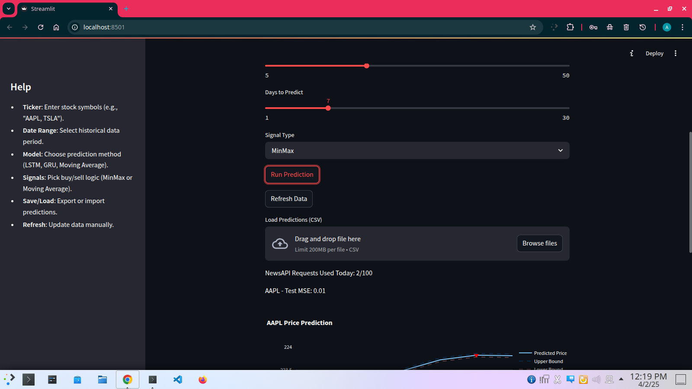
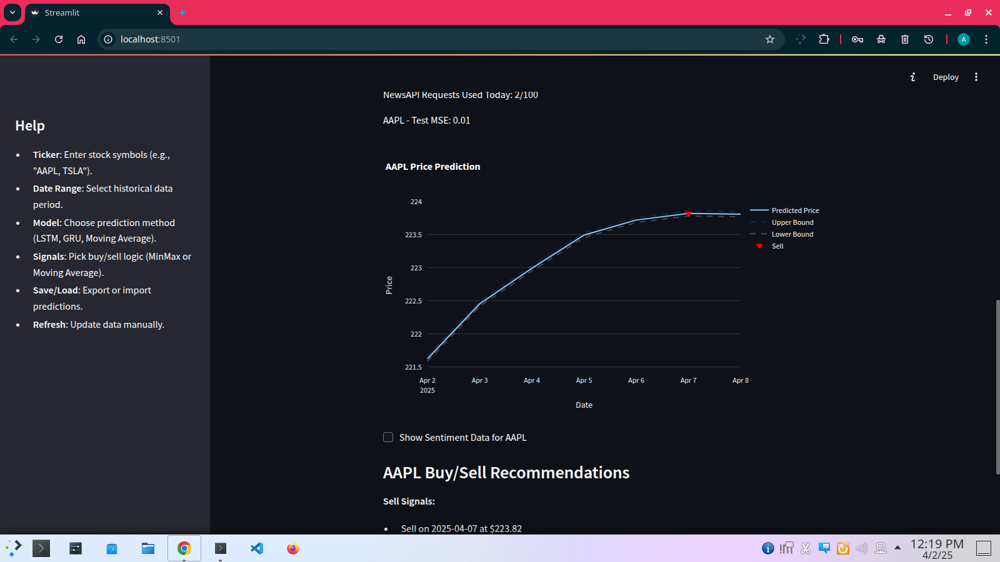
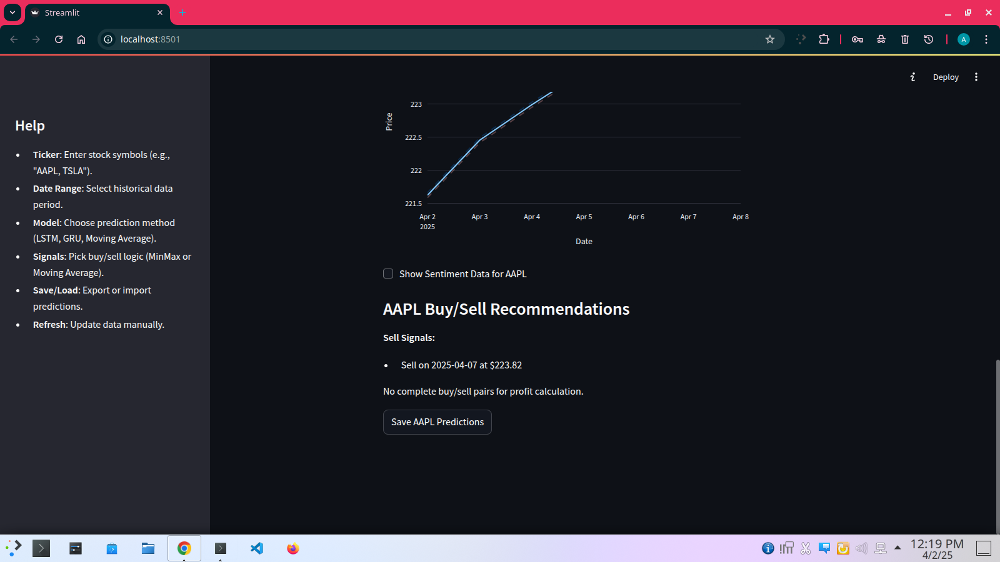

# Stock Price Prediction with Buy/Sell Signals

A comprehensive stock prediction tool using historical data and NewsAPI sentiment, with an interactive Streamlit UI.

## Features
- Multiple stock comparison (e.g., "AAPL, TSLA").
- Custom date range for historical data.
- Model options: LSTM, GRU, Moving Average.
- Adjustable prediction horizon with confidence intervals.
- Signal types: MinMax, Moving Average crossovers.
- Profit/loss estimation for trades.
- Interactive Plotly plots for price and sentiment.
- Performance metrics (MSE, trade success).
- Save/load predictions as CSV.
- Real-time data refresh.
- Help section, ticker validation, API limit tracking.

## Screenshots

### Dashboard


### Settings


### Data Fetch Example


### Buy & Sell Recommendations


## Installation
1. Clone the repo:
   ```bash
   git clone https://github.com/your-username/Stock-Price-Prediction.git
